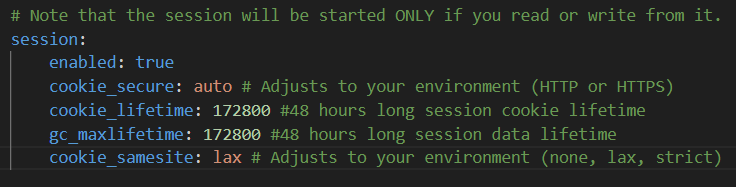
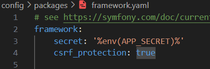

# Sécurisation de l'application
## Authentification 48h

*Si l'image ne s'affiche pas, consulter assets/img/cookie*

Ajouts dans **session** dans config/packages/framework.yaml, les 2 lignes importantes sont "cookie_lifetime" qui permet de définir le temps de vie, en secondes, du cookie côté client (ici 172800 secondes pour 48h commme demandé) ainsi que "gc_maxlifetime" qui gère côté serveur. 

## Protection CSRF

La protection CSRF (Cross-Site Request Forgery) est une mesure de sécurité importante qui permet d'ajouter un token CSRF dans des requêtes sensibles, ce qui permet de prouver que ces dernières proviennent bien du vrai site et non pas d'un autre domaine cherchant à se faire passer pour.

*Si l'image ne s'affiche pas, consulter assets/img/csrf*

Simple changement (décommenter la ligne) dans config/packages/framework.yaml

## Vulnérabilité des dépendances

Commande **composer audit** afin de pouvoir voir quelles dépendances possèdent des vulnérabilités potentielles.

*Si l'image ne s'affiche pas, consulter assets/img/Symfony dependances*

Le terminal affiche la liste de dépendances susceptibles de créer des brèches de sécurité.